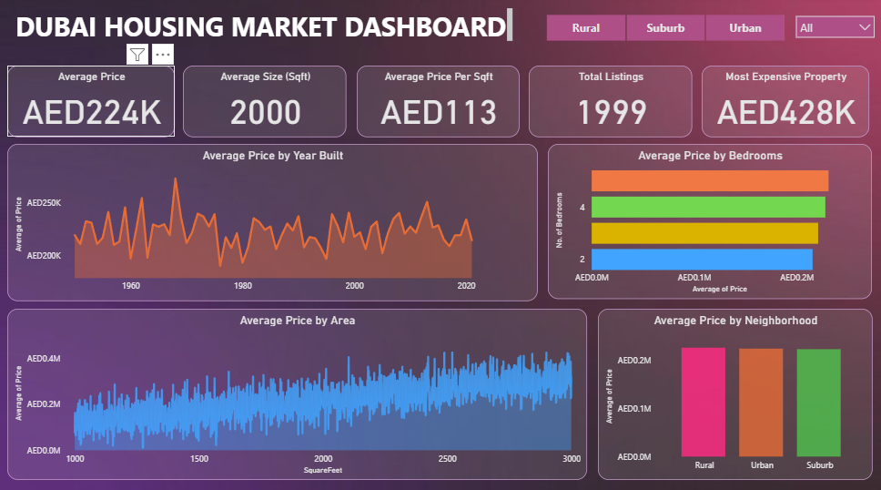

Dubai Housing Market Analysis Dashboard
Project Overview:

This project analyzes the Dubai housing market using data visualization and exploratory analysis. The goal of the project is to understand how different property characteristics such as neighborhood type, property size, number of bedrooms, and construction year influence housing prices.

An interactive Power BI dashboard was developed to explore these relationships and identify key patterns in the Dubai real estate market.

Tools Used

Power BI

Excel (for data preparation)

Dataset

The dataset contains information about residential properties in Dubai. The key features included in the dataset are:

Property price

Neighborhood type (Rural, Urban, Suburb)

Number of bedrooms

Property area (square feet)

Year built

The dataset was cleaned and prepared before building the Power BI dashboard.

Dashboard Overview

The Power BI dashboard provides visual insights into the housing market through multiple analytical views, including:

Average Price by Neighborhood

Average Price by Bedrooms

Price Trends by Year Built

Relationship Between Property Area and Price

These visualizations help understand pricing patterns and property distribution across different neighborhoods.

Dashboard Preview

Key Insights

Some key findings from the analysis include:

Rural properties in the dataset have the highest average price, slightly higher than Urban and Suburb areas.

Urban and Suburb neighborhoods show similar price levels, indicating consistent demand across these areas.

The average property age is approximately 39 years, suggesting many properties are older builds with potential renovation opportunities.

Suburb areas contain the highest number of listings in the dataset.

Property prices generally increase with larger property area and higher number of bedrooms.

For the complete analysis and detailed insights, refer to the report below.

Detailed Insights Report

A complete report containing detailed insights and visual explanations is available in the repository:
Dubai Housing Market(Insights.pdf)

Conclusion

This project highlights how property features such as location, property size, and number of bedrooms influence housing prices in Dubai. The Power BI dashboard provides an interactive way to explore these insights and better understand market trends.

Repository Structure
Dubai-Housing-Market-Analysis
│
├── README.md
├── Insights.pdf
├── Dubai Housing Dashboard.pbix
└── dashboard.png
